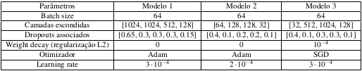
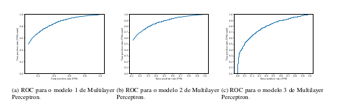
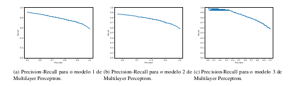
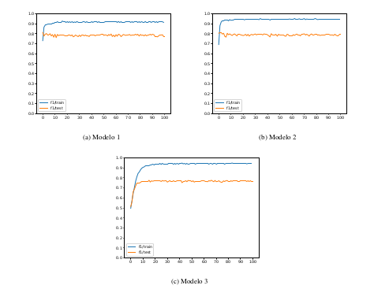

# Binary classifier (MLP model) for glomerular lesions

This repository consists of a complete pipeline for a binary classifier used for identfying the presence (or not) of lesions in glomerular images, which is composed (mainly) of two parts:

1. A series of pre-processing transformations that 
    - Generate an augmented dataset via gamma correction, Gaussian suavization, Laplace filters and histogram equalization (folder `spatial-transforms`)
    - Extract features LBP, GLCM, contrast vector and Sobel filter from each image taken from the augmented dataset (folder `features`)
2. A MLP (Multilayer Perceptron) model (notebook `glomerulus.ipynb`) that receives a feature vector - the concatenation of all the previous features - for each image in the augmented dataset, and tries to predict the class out of two options:
    - Normal (no lesions)
    - Presence of crescent formations

This codebase is the accumulated result of four different assignments in the graduate course "Tópicos Especiais em Mecatrônica IV" (originally "Tópicos em Computação Visual I" - which roughly translates to "Topics in Computer Vision I").

However, since the dataset is private, this project can not be run, and serves only as an approximate mirror of the work done.

# Results obtained

Three different network architectures were trained in this experiment - the results for the first architecture were outlined below (the other two achieved similar value for the measured metrics). Each model's complete set of logs and plots - that give the full overview of its perfomance - is in the respective model's folder.

More specifically, the following three arhcitectures were used, as seen in the following table:

 for each of the 3 models")

